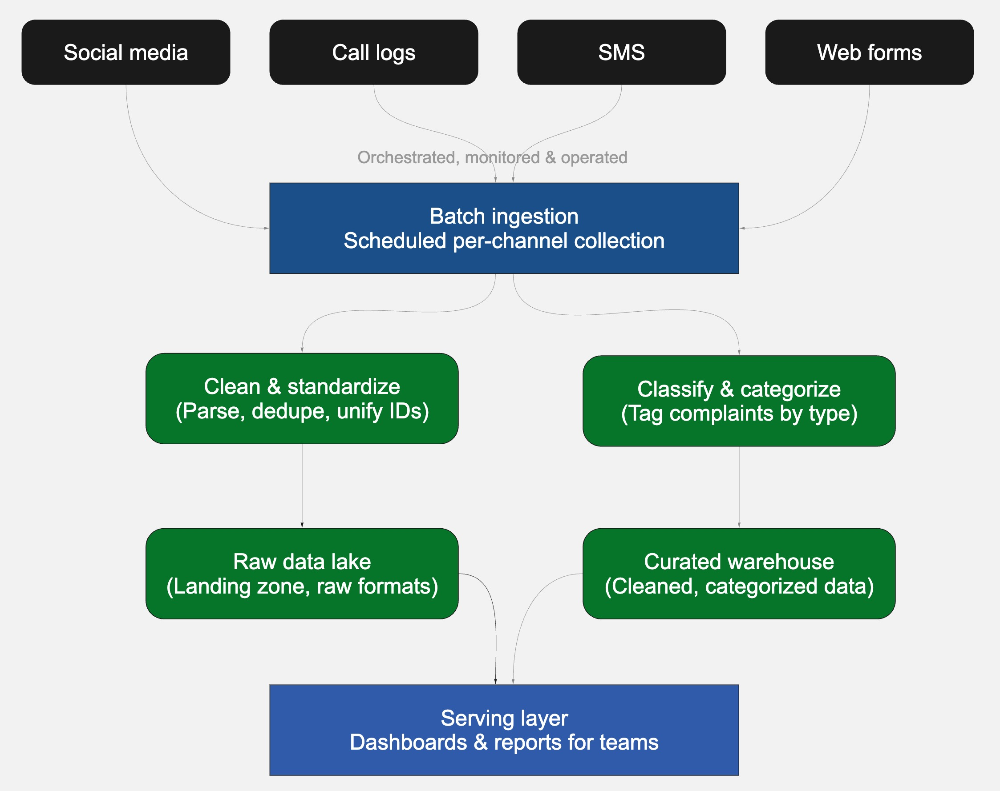

# Beejan Technologies — Conceptual data pipeline
### Hybrid Model: real-time and batch pipeline

**Business scenario:** Beejan Technologies receives customer complaints (poor network, incorrect billing, bad customer service) through four channels — social media, call center log files, SMS, and website forms. Data is siloed, reports are compiled manually, and nothing is delayed by design; this pipeline brings all four channels together, cleans and enriches the data, and makes it ready for reporting.

---

## 1. General

**Design choices**
Not every channel has the same urgency, so this design treats them differently instead of forcing one cadence on all of them. Social media and SMS — where a spike could signal a live network outage — flow through a real-time path so problems surface within minutes. Call-center logs and web forms, which are naturally produced in batches anyway, flow through a scheduled path. Both paths converge into one shared storage layer, so reporting always has a single, complete view regardless of which path a given complaint took.

**Assumptions / Thought process**
- Only some channels genuinely need near-real-time handling; the rest are fine on a scheduled cadence, so the added complexity of two paths is worth it.
- The two processing paths can apply the same cleaning and classification rules, just at different speeds, so the merged data stays consistent.
- The business has a genuine use case for near-real-time visibility (e.g. detecting an outage as complaints spike), not just historical reporting.

**Challenges or unknowns**
- Running two processing paths side by side is harder to build, test, and operate than one, and keeping their logic in sync over time is a real risk.
- Classifying short, informal real-time text (a social post or SMS) accurately in the moment is harder than classifying it with more context and time in batch.
- Deciding what counts as "urgent enough" to route through the real-time path is a judgment call that would need real usage data to calibrate.

**Other information**
Scheduling, failure detection/alerting, and environment management apply across both paths rather than being a separate stage — and here they're more demanding than a pure batch design, since two independent paths both need to be monitored and kept healthy at the same time.

---

## 2. Details

**1. Source identification**

*Data sources* Four channels: social media (public posts and mentions), call center log files (agent-recorded interaction logs), SMS (inbound text complaints), and website forms (structured web submissions) — grouped here by urgency rather than treated uniformly. Social media and SMS are the two channels most likely to spike suddenly (e.g. during a network outage), so they're treated as time-sensitive. Call center logs and web forms are naturally produced in batches already (end-of-shift logs, periodic form exports), so they're treated as non-urgent.

*Formats and Frequency* Batch and streaming. Social media and SMS are handled as continuous event streams. Call center logs and web forms remain batch (JSON), arriving as periodic files or exports (CSV).

**2. Ingestion strategy**

*API ingestion, file uploads, or streaming* All three, split by channel. Social media and SMS use streaming ingestion — each new post or text is picked up as an individual event as it arrives, rather than waiting for a scheduled pull. Call center logs use file-based ingestion (periodic log exports). Web forms use scheduled API or file-based ingestion.

*Real-time data handling* As a genuine live stream — this is the core structural feature of this design. Instead of polling on an interval, social media (and SMS) events are consumed continuously as they occur, so a sudden spike in complaints becomes visible within minutes rather than waiting for the next scheduled batch run.

**3. Processing / Transformation**

*Cleaning and standardizing the data* Two parallel processing paths apply the same logical cleaning steps — parsing, normalizing timestamps, deduplicating, unifying customer identifiers — but at different speeds. Stream processing cleans each event individually and continuously as it arrives. Batch processing cleans grouped records on a schedule. Keeping the cleaning rules identical across both paths, just executed at different cadences, is what keeps the merged output consistent.

*Classifying complaints into categories* According to a shared category scheme (network, billing, customer service, etc.), which is applied in both paths, so a complaint is categorized the same way whether it arrived through the real-time path or the batch path — only the speed of classification differs, not the logic.

**4. Storage options**

*Data lake and/or Data warehouse?* Both, but unified rather than duplicated. A single storage layer holds both a raw zone and a curated zone, and both the stream path and the batch path write into the same shared storage rather than each maintaining its own separate lake and warehouse. This is what guarantees reporting always sees one complete picture instead of two partial ones that need reconciling.

*Format of the cleaned data be stored in (Parquet, JSON, etc.)?* Native formats are preserved in the raw zone; a structured, columnar, query-optimized format is used in the curated zone — regardless of whether a given record arrived via the stream path or the batch path.

**5. Serving**

*Querying the data* Two ways from the same underlying storage: a near-real-time view for monitoring current activity (e.g. "complaints in the last hour by category"), and standard structured queries against the curated zone for historical reporting.

*How will the downstream users use this data?* Support and operations teams watch live dashboards to catch spikes as they happen — for example, a sudden jump in network complaints signaling an outage. Management continues to consume standard periodic reports. Both consumer types draw from the same unified storage, so there's no discrepancy between what the live view shows and what the historical report later confirms.

**6. Orchestration & monitoring**

*How often will this pipeline run?* Two coexisting cadences: the streaming path runs continuously (always on, processing events as they arrive), while the batch path runs on a fixed schedule (e.g. every few hours or daily).

*How will failures be detected or notified?* Differently per path, because "failure" looks different for each. The streaming path is monitored for health signals like processing lag or a drop in throughput — a sign events are backing up or the stream has stalled. The batch path is monitored via job success/failure and record-count anomalies. Both feed into the same alerting process so the data team has one place to see problems from either path.

**7. Dataops**

*Where will the pipeline run?* Two operating models running side by side: an always-on component for the streaming path, and a scheduled-job component for the batch path, both logically separate from the customer-facing production systems they read from.

*How will you make it available in production?* Both paths need independent validation before go-live — the streaming path is tested for sustained, always-on operation, while the batch path is validated the same way any scheduled job would be. Once both are confirmed healthy independently, they're promoted together, and both are monitored on an ongoing basis rather than just the once-per-run checks a pure batch design would need.

---

## 3. Pipeline diagram

It shows four source channels splitting into a real-time path (social media, SMS → streaming ingestion → stream processing) and a batch path (call logs, web forms → batch ingestion → batch processing), both converging into unified storage, and finally splitting into two serving outputs — live dashboards for spike detection and standard reports for management. A dashed boundary marks what orchestration, monitoring, and dataops govern across both paths end to end.
